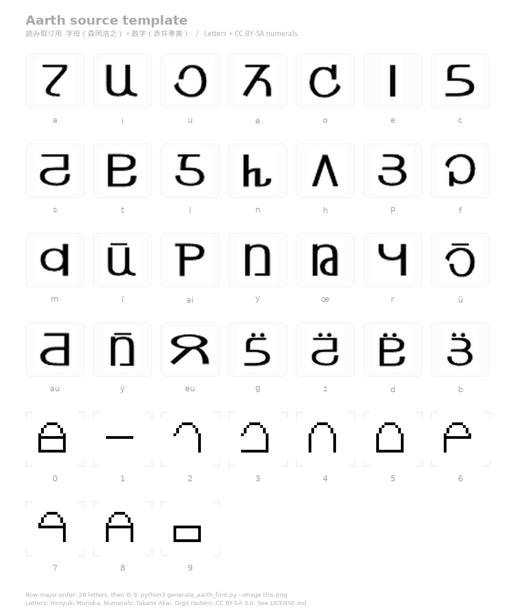

# アーヴ語とアース

[アーヴ語（Baronh）](https://ja.wikipedia.org/wiki/%E3%82%A2%E3%83%BC%E3%83%B4%E8%AA%9E) と、それを書く文字 [アース（Ath）](https://ja.wikipedia.org/wiki/%E3%82%A2%E3%83%BC%E3%83%B4%E8%AA%9E) についての二次創作です。GitHub Pages で字形デモと翻訳ツールを公開しています。

- **アース**: 字母（森岡浩之）と数字 0–9（赤井孝美）をウェブフォント（`aarth.ttf` / `aarth.woff2`）にしたもの。既定の入力は `templates/ath_source_filled.png` です。
- **アーヴ語**: 辞書と文法規則で日本語・英語と行き来する翻訳（CLI とブラウザ）。

## サイト

公開サイト（GitHub Pages）: **https://7474.github.io/Ath/**

| パス | 内容 |
|---|---|
| [`/`](index.html) | アーヴ語とアースの概要 |
| [`/ath/`](ath/index.html) | アースの字形デモ（帝国国歌の組版、Translate で読み下し） |
| [`/web/`](web/index.html) | アーヴ語の翻訳ツール（辞書・文法・音声） |

ローカルでは `python3 -m baronh serve`（既定 http://127.0.0.1:8765/）か、リポジトリ根で `python3 -m http.server 8000` です。他サイトからフォントを URL 指定する場合は [jsDelivr](#jsdelivr) を使ってください。GitHub Pages はサイト本体であり、フォント配信の CDN ではありません。

## 出典・ライセンス

[Wikipedia「アーヴ語」](https://ja.wikipedia.org/wiki/%E3%82%A2%E3%83%BC%E3%83%B4%E8%AA%9E) によれば、アースの**字母は原作者の森岡浩之**、**数字は原作イラストの赤井孝美**が設計しました。アーヴ語およびアースは森岡浩之『星界シリーズ』の架空言語・文字体系であり、本リポジトリのフォントと翻訳ツールはその設定に基づく**二次創作**です。

| 区分 | 設計 | ラスタ出典 | ラスタのライセンス |
|---|---|---|---|
| 字母 28 字 | 森岡浩之 | [Ath (alphabet).png](https://commons.wikimedia.org/wiki/File:Ath_(alphabet).png) | パブリックドメイン |
| 数字 0–9 | 赤井孝美 | [TRON 9-9830](https://commons.wikimedia.org/wiki/File:TRON_9-9830.gif)–[9-9839](https://commons.wikimedia.org/wiki/File:TRON_9-9839.gif)（`templates/digits/`） | [CC BY-SA 3.0](https://creativecommons.org/licenses/by-sa/3.0/) |

数字ラスタが CC BY-SA 3.0 のため、それを含む結合成果物（記入済みテンプレートと本ウェブフォント）も **CC BY-SA 3.0** です。再利用・改変時は出典表示（設計者・ラスタ出典・ライセンス）と同一ライセンスでの共有が必要です。詳細は [LICENSE.md](LICENSE.md) を参照してください。

---

## ウェブフォント

字母に加え、数字 0–9 もグリフ化します。自前のラスタを使う場合は [入力テンプレート](#入力テンプレート) を `--image` または `--digits-image` で渡してください。

### Character mapping

The 28 Ath phonemes are mapped to the following Unicode code points:

| Ath phoneme | Unicode | Key to type |
|---|---|---|
| a | U+0061 | `a` |
| i | U+0069 | `i` |
| u | U+0075 | `u` |
| é | U+00E9 | `é` |
| o | U+006F | `o` |
| e | U+0065 | `e` |
| c | U+0063 | `c` |
| s | U+0073 | `s` |
| t | U+0074 | `t` |
| l | U+006C | `l` |
| n | U+006E | `n` |
| h | U+0068 | `h` |
| p | U+0070 | `p` |
| f | U+0066 | `f` |
| m | U+006D | `m` |
| ï | U+00EF | `ï` |
| ai (digraph) | U+0041 | `A` |
| y | U+0079 | `y` |
| œ | U+0153 | `œ` |
| r | U+0072 | `r` |
| ü | U+00FC | `ü` |
| au (digraph) | U+0049 | `I` |
| ÿ | U+00FF | `ÿ` |
| eu (digraph) | U+0045 | `E` |
| g | U+0067 | `g` |
| z | U+007A | `z` |
| d | U+0064 | `d` |
| b | U+0062 | `b` |
| 0 | U+0030 | `0` |
| 1 | U+0031 | `1` |
| 2 | U+0032 | `2` |
| 3 | U+0033 | `3` |
| 4 | U+0034 | `4` |
| 5 | U+0035 | `5` |
| 6 | U+0036 | `6` |
| 7 | U+0037 | `7` |
| 8 | U+0038 | `8` |
| 9 | U+0039 | `9` |

数字 0–9 は赤井孝美の設計に基づく TRON ラスタを既定で取り込みます。`--image Ath_alphabet.png` のように字母画像だけを渡すと、字母 28 字のみになります。

### 転写とグリフの留意点

フォント cmap（`generate_aarth_font.py` の `ALPHABET_CODEPOINTS`）は [Ath (alphabet).png](https://commons.wikimedia.org/wiki/File:Ath_(alphabet).png) の **4×7 ラベル順**に割り当てます。`to_ath_keys` も同じ順です。Wikipedia「[アーヴ語](https://ja.wikipedia.org/wiki/%E3%82%A2%E3%83%BC%E3%83%B4%E8%AA%9E)」は、資料によって **au と o**、**p と eu** の音価対応が揺れると注記しています。本リポジトリはラベル付き Commons 画像の順を正とし、辞書のラテン転写もそのラベル（`a i u é o e c` …）に揃えます。画像の字形を別のラテン字へ載せ替えることはしません。

層は次の二つです。混同しないでください。

| 層 | 中身 | 例 |
|---|---|---|
| Wikipedia 転写（辞書見出し） | 字母 1 字をラテン 1 字、ただし `ai` `au` `eu` は 2 字 | `bœrh`, `greuc`, `sairh` |
| Aarth キー（フォント入力） | 上の 2 字を Nine Lives の `A` `I` `E` へ | `bœrh`, `grEc`, `sArh` |

辞書・訳文は転写のまま持ち、表示時だけ `to_ath_keys`（Python / `web/js/engine.js`）が二重字をキーへ落とします。見出しに素の `A` `I` `E` は出しません。

ファン資料の代用綴りは **取り込み時**（`fold_fan_romanization`）に Wikipedia 転写へ畳みます。lookup も同じ畳みを通す（Python と `foldFanRomanization`）ので、`boerh` で `bœrh` を引けます。

| 資料 | 代用 | 正規 | 備考 |
|---|---|---|---|
| Dadh Baronr（Latin-1 / euc-jp） | 語中の `oe` | `œ` | Latin-1 に œ が無い。`boerh` → `bœrh` |
| 同上 | 語末の `oe` | そのまま | o 語幹 + 不定詞 `-e`（`boe` 思う、`ramgoe` さまよう）。`œ` ではない |
| アーヴ語掻き集め | `&#339;` | `œ` | HTML 実体。パーサが既に œ にする |
| 同上 | `e'` | `é` | `spe'nec` → `spénec`。読み仮名も「スペーヌ」 |
| シード / 固有名詞転記 | `k j v w q x` | `c gh bh u c cs` | アースに無いラテン字。`ïku` → `ïcu` |

畳まないもの:

- 主題の `F'a`（`e'` ではなく `'a`）
- 接辞のハイフン（`-ad-`）。字母ではない
- 数字 0–9。フォントにはあるが辞書見出しには出ない（数字用グリフ）

字母 28 字はいずれも現行辞書に現れます。回帰は次です。

- `tests/test_baronh_ingest_cli.py` の `test_lexicon_letters_are_ath_glyphs`（見出しを `to_ath_keys` したあと、字母 cmap と空白・ハイフンだけ）
- 同ファイルの `test_ingested_dadh_uses_wikipedia_oelig`（`boerh` ではなく `bœrh`）
- `tests/test_baronh_fanlex.py`（語中 `oe`、語末 `oe`、`e'`、`k`）

---

### CSS / HTML usage

### jsDelivr

```html
<link rel="stylesheet" href="https://cdn.jsdelivr.net/gh/7474/Ath@main/docs/aarth.css">
<style>
  .ath { font-family: 'Aarth', serif; }
</style>
<p class="ath">aarth lotr atosr</p>
```

`@font-face` を自分で書く場合:

```css
@font-face {
  font-family: 'Aarth';
  src: url('https://cdn.jsdelivr.net/gh/7474/Ath@main/docs/aarth.woff2') format('woff2'),
       url('https://cdn.jsdelivr.net/gh/7474/Ath@main/docs/aarth.ttf')   format('truetype');
  font-weight: normal;
  font-style:  normal;
  font-display: swap;
}
```

### ローカルに置く（オフライン用）

```html
<style>
  @font-face {
    font-family: 'Aarth';
    src: url('aarth.woff2') format('woff2'),
         url('aarth.ttf')   format('truetype');
    font-weight: normal;
    font-style:  normal;
    font-display: swap;
  }

  .ath {
    font-family: 'Aarth', serif;
  }
</style>

<p class="ath">aarth lotr atosr</p>
```

---

### Quick start

リポジトリをクローンしたあと、次の手順でフォントをローカル生成できます。

### 1. Install system tools

```bash
# Debian / Ubuntu
sudo apt-get install potrace

# macOS
brew install potrace

# Windows — download the binary from http://potrace.sourceforge.net/
```

### 2. Install Python packages

```bash
pip install -r requirements.txt
```

### 3. Generate the font

```bash
python3 generate_aarth_font.py
```

スクリプトは次を行います。

1. 既定では `templates/ath_source_filled.png` を読む（`--image <path>` でも指定可。無ければ Wikimedia Commons の字母画像）。
2. 画像を二値化し、28 個の字母領域を検出する。同じシートまたは `--digits-image` に数字 0–9 があれば続けて検出する。
3. 成分ごとにシルエットを整え、`potrace` でベクター化する（bitmap → SVG cubic Bézier）。
4. CFF ベースの OpenType フォントを組み立て、WOFF2 に圧縮する。

出力はデフォルトでカレントディレクトリです（`--output-dir`）。

```
aarth.ttf    — OpenType/CFF font（互換性が広い）
aarth.woff2  — モダンブラウザ向けの圧縮 Web フォント
```

### 4. Preview in a browser

リポジトリ根で HTTP サーバを起動します（`aarth.css`、`aarth.woff2`、`aarth.ttf` が根にあること）。概要は `/`、字形デモは `/ath/`、翻訳は `/web/` です。

```bash
python3 -m http.server 8000
# http://127.0.0.1:8000/
# http://127.0.0.1:8000/ath/
# http://127.0.0.1:8000/web/
```

---

### 入力テンプレート

字母と数字を **1 枚のラスタ画像** から読むときのセル配置です。左上から行優先（左→右、上→下）。ラベルはセルの下に小さく書き、グリフ本体より十分低くしてください（検出時にラベルは捨てます）。

```
a   i   u   é   o   e   c
s   t   l   n   h   p   f
m   ï   ai  y   œ   r   ü
au  ÿ   eu  g   z   d   b
0   1   2   3   4   5   6
7   8   9
```

同じ配置のシートを同梱しています。

| ファイル | 用途 |
|---|---|
| `templates/ath_source_filled.png` | **読み取り用（既定）。** 字母（森岡浩之）＋数字（赤井孝美 / CC BY-SA 3.0） |
| `templates/ath_source_template.png` | **読み取り用。** 字母だけ埋め込み、数字セルは空欄 |
| `templates/ath_blank_template.png` | **未記入。** 字母・数字とも空欄。全グリフを手描きするとき |
| `templates/digits/` | 数字 0–9 の CC BY-SA 3.0 ラスタ（TRON 9-9830–9-9839） |

再生成:

```bash
python3 generate_aarth_font.py --write-template templates/
```

読み取り用（字母＋数字）:



読み取り用（数字空欄）:


未記入（空白）:


使い方:

1. 既定の生成は記入済みシートを使います。数字だけ描き直すなら空欄シートをコピーし、空の数字セルに黒インクで 0–9 を描く。全字形を描くなら未記入シートを使う。
2. 白地・黒字形のまま PNG で保存する（ガイドやラベルは薄いグレーのまま残してよい）。
3. フォントを生成する。

```bash
# 既定（字母＋数字の記入済みテンプレート）
python3 generate_aarth_font.py

# 字母＋数字が 1 枚に入っている場合
python3 generate_aarth_font.py --image path/to/filled_template.png

# 字母は従来画像、数字だけ別ラスタ（7+3 または横 10 セル）
python3 generate_aarth_font.py --image Ath_alphabet.png --digits-image path/to/digits.png
```

数字だけを描く場合も、上の 5–6 行目と同じ **7+3**（または横一列の 10 セル）にしてください。アースの数字字形は原作イラストの赤井孝美氏による設計です。ラスタは CC BY-SA 3.0 です。全グリフを自前で描く場合は未記入テンプレートを使ってください。

---

### Command-line options

| Option | Default | Description |
|---|---|---|
| `--image` | filled template if present | Local path or HTTP URL of the alphabet (or combined) PNG |
| `--digits-image` | off | Optional PNG of numerals 0–9 (`7+3` or one row of 10) |
| `--write-template` | off | Write reading + blank templates to a PNG path or directory, then exit |
| `--output-dir` | `.` | Directory to write output files |
| `--debug` | off | Save `debug_boxes.png` (and `debug_digit_boxes.png` when digits are present) |

---

### Pipeline overview

```
Ath_(alphabet).png  [+ optional digits raster / extra template rows]
        │
        ▼
  OpenCV binarise + denoise
        │
        ▼
  cv2.findContours → merge overlines/umlauts
        → 4×7 alphabet boxes, then 0–9 if present (row-major)
        │
        ▼  (per glyph)
  per-component silhouette → SDF smooth + 8× → PGM → potrace --svg --blacklevel → SVG path
        │
        ▼
  Scale & translate to 1000-unit EM (ascender=800, descender=-200)
        │
        ▼
  fontTools FontBuilder (CFF/OTF, cubic Bézier)
        │
        ├──▶ aarth.ttf
        └──▶ aarth.woff2  (via fontTools woff2 compress)
```

---

## アーヴ語翻訳（CLI / Web）

アーヴ語 (Baronh) と日本語・英語を、**ローカルの辞書と文法規則**で翻訳します。公式の完全辞書は公開されていないため、文法の骨格は Wikipedia「[アーヴ語](https://ja.wikipedia.org/wiki/%E3%82%A2%E3%83%BC%E3%83%B4%E8%AA%9E)」（CC BY-SA）に依り、語彙は下記ファンサイトを走査して拡充しています。辞書にない固有名詞は日本語ローマ字ではなくアーヴ語の正書法へ発音転記し、訳にその旨を示します。追加の個人辞書は `data/user_lexicon.json` に足せます。

構成は次のとおりです。規則ベースは生成 AI 無しで動きます。サーバエージェントは生成 AI が、ベクトル検索した辞書と文法コンテキストで訳します。

```
入力（ja / en / baronh）
        │
        ▼
  辞書 lookup + 格変化 / 動詞活用   ← data/lexicon.json
        │
        ├──▶ 規則ベースの訳（`--engine local`）
        ├──▶ サーバエージェント（推奨の生成経路。生成 AI 必須）
        │      ベクトル検索した辞書 + 文法コンテキストでモデルが文を組む
        │      POST /api/translate （python -m baronh serve / Cloud Run）
        └──▶ ブラウザ生成AI: ページ内ベクトルDB + 文法コンテキストで Chat Completions
        │
        ▼
  読み仮名 → Web Speech / espeak-ng / OpenAI TTS
```

生成経路の詳細とクラウドの載せ方は [baronh/ARCHITECTURE.md](baronh/ARCHITECTURE.md) と [baronh/DEPLOY.md](baronh/DEPLOY.md) を参照する。

要点だけ示す。

- 他言語 → アーヴ語では、辞書に無い普通名詞を造語せず、ベクトル検索と語釈の類義語で意味が通るように寄せる（例: 「光」→ `sairiac`「輝くもの」）。固有名詞は発音転記のまま。
- 原文は常にモデルへ渡す。生成 AI の誤字耐性（原文を読む力）は残す。
- エージェントの検索はプロセス内のハッシュ n-gram ベクトル索引である。外部のベクトル DB は使わない。文法はシステムプロンプトに全文を載せる。
- 残す照合: ヴ/ブ・長音・ひらがなカタカナの畳み込み、ラテン綴りの 1 文字差、短い類義語への寄せ、ベクトル検索。
- 捨てる照合: 日本語の部分一致、複合語への吸い込み、日本語同士の 1 文字差。
- 生成したアーヴ語は辞書語形と照合し、造語なら再生成する。エージェントは規則下訳に戻さない。
- 音声合成は `{base}/audio/speech` で、入力は仮名読みである。

### CLI

追加の pip 依存は、フォント生成とサーバエージェントのベクトル索引で `numpy` が必要です。規則ベースの翻訳だけなら標準ライブラリで動きます。リポジトリ根で次を実行します。

```bash
# 翻訳
python3 -m baronh translate "私は移民します" --from ja --to baronh
python3 -m baronh translate "星たちの光を見ます" --from ja --to baronh --vector-search

# 辞書・変化
python3 -m baronh lookup アーヴ
python3 -m baronh decline abh
python3 -m baronh conjugate sac --all

# サイト / ファイルから辞書を取り込む
python3 -m baronh ingest known              # 掻き集め + Dadh Baronr を走査
python3 -m baronh ingest wikipedia
python3 -m baronh ingest data/examples/sample.csv
python3 -m baronh ingest https://ja.wikipedia.org/wiki/アーヴ語

# 読みと音声（espeak-ng があれば WAV、無ければ読み仮名）
python3 -m baronh reading "F'a usere." --ath
python3 -m baronh speak "F'a usere." --out /tmp/baronh.wav

# サーバエージェント（生成 AI 必須。OPENAI_API_KEY または OPENAI_BASE_URL）
python3 -m baronh translate "星たちの光を見ます" --from ja --to baronh --engine agent

# 任意: OpenAI 互換 API を CLI から直接（実験）
python3 -m baronh translate "I am Abh." --from en --to baronh --engine openai
python3 -m baronh translate "私はアーヴです" --engine openai \
  --api-base http://127.0.0.1:1234/v1 --api-key local --model llama3
python3 -m baronh speak "F'a bale." --engine openai --out /tmp/baronh.mp3

# Web UI（既定 http://127.0.0.1:8765/ が概要、翻訳は /web/、エージェントは POST /api/translate）
python3 -m baronh serve

# GitHub Pages / ブラウザ用に辞書 JSON とベクトル索引を書き出す（CI でも実行）
python3 -m baronh export-web --out web/data
```

`ingest known` は [アーヴ語掻き集め](http://mule.s59.xrea.com/seikai/jisyo/) と [Dadh Baronr 私家版辞書](http://dadh-baronr.s5.xrea.com/etc/ondic.html) を走査し、`data/ingested.json` に書き出します。その他の URL / CSV は `data/user_lexicon.json`（gitignore 済み）へ上乗せします。古いファンサイトは euc-jp / Shift_JIS のことがあります。見出しのラテン転写の畳み（`oe`→`œ`、`e'`→`é`、`k`→`c` など）は [転写とグリフの留意点](#転写とグリフの留意点) を参照してください。

### スペシャルサンクス

語彙の拡充にあたり、次の公開資料を走査させていただきました。いずれもファンによる再構成であり、公式辞書ではありません。森岡浩之氏はこれらの内容に関知していません。

- [アーヴ語掻き集め『アーヴ語辞書』](http://mule.s59.xrea.com/seikai/jisyo/)（2005-01-23 版）
- [Dadh Baronr『Sidrÿac Borgh=Racair Mauch の私家版アーヴ語辞書』](http://dadh-baronr.s5.xrea.com/etc/ondic.html)

### Web

`web/` は GitHub Pages の翻訳ページ（[`/web/`](web/index.html)）の静的ファイルです。辞書 JSON を読み、格変化・規則翻訳・読み上げまでブラウザ内で完結します。アーヴ語を選んだ入出力のテキストエリアだけアース文字フォントで表示します。

サーバエージェントを使うときは、同じプロセスの `/api/translate`（`python -m baronh serve`）か、Cloud Run などに載せた URL を設定します。生成 AI が未構成なら翻訳ページのエンジン選択肢からサーバエージェントを外します。GitHub Pages だけではサーバエージェントは動きません。ブラウザの生成AIは、GitHub Actions が事前構築したベクトル索引（`vectors.bin`）と文法コンテキストで Chat Completions を呼びます。ローカルでは `python3 -m baronh export-web` が同じファイルを `web/data/` に書き出します。詳細は [baronh/ARCHITECTURE.md](baronh/ARCHITECTURE.md) と [baronh/DEPLOY.md](baronh/DEPLOY.md) です。

サイト全体を見るときは `python3 -m baronh serve`（概要 `/`、アース `/ath/`、翻訳 `/web/`）か、ルートで `python3 -m http.server 8000` です。

### 取り込みファイル形式

CSV の列は `lemma,gloss_ja,gloss_en,pos,declension,stem` です。`pos` は `noun` / `verb` / `pronoun` / `postposition` など。名詞の `declension` は Wikipedia の第1–4型に対応する `1` `2` `3` `4` です。

JSON は次の形です。

```json
{
  "entries": [
    {"lemma": "socoth", "gloss_ja": "学校", "gloss_en": "school", "pos": "noun", "declension": "2", "stem": "socot"}
  ]
}
```
