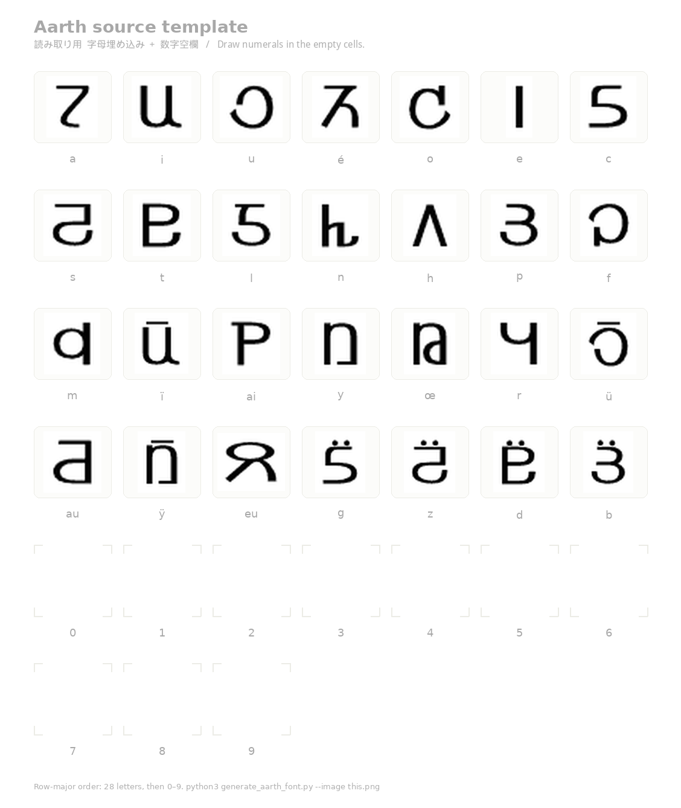
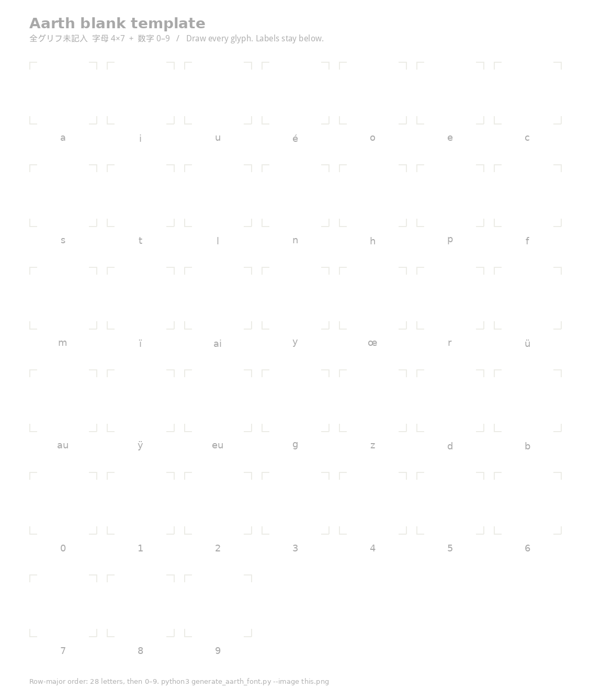

# Aarth — Ath Alphabet Webfont

[アース（Ath）](https://ja.wikipedia.org/wiki/%E3%82%A2%E3%83%BC%E3%83%B4%E8%AA%9E) の字形を抽出し、Web フォント（`aarth.ttf` / `aarth.woff2`）にしたものです。

字母に加え、同じラスタ入力（または別画像）から **数字 0–9** もグリフ化できます。数字の公式ラスタがリポジトリに無い場合は、下の [入力テンプレート](#入力テンプレート) に描いて `--image` または `--digits-image` で渡してください。数字だけ足すなら読み取り用、全グリフを描くなら未記入シートを使います。

## デモ

公開デモ（GitHub Pages）: **https://7474.github.io/Ath/**

アーヴ語翻訳（辞書・文法・音声）: 同じ Pages の [`web/`](web/index.html)、またはローカルで `python3 -m baronh serve`。

GitHub Pages はプロジェクトのショーケース用です。他サイトからフォントを URL 指定する場合は [jsDelivr](#jsdelivr) を使ってください。

## 出典・ライセンス

字形の出典は、日本語版 Wikipedia「[アーヴ語](https://ja.wikipedia.org/wiki/%E3%82%A2%E3%83%BC%E3%83%B4%E8%AA%9E)」に添付されているパブリックドメイン画像 [Ath (alphabet).png](https://ja.wikipedia.org/wiki/%E3%82%A2%E3%83%BC%E3%83%B4%E8%AA%9E#/media/%E3%83%95%E3%82%A1%E3%82%A4%E3%83%AB:Ath_(alphabet).png/2) です。著作権者により [パブリックドメイン](https://commons.wikimedia.org/wiki/File:Ath_(alphabet).png) として公開されています。

アーヴ語およびアースは、森岡浩之『星界シリーズ』に登場する架空言語・文字体系です（字母の設計は原作者の森岡浩之）。本フォントはその設定に基づく**二次創作**です。二次創作であることを前提に、自由に使っていただいて構いません。

関連情報は [Wikipedia「アーヴ語」](https://ja.wikipedia.org/wiki/%E3%82%A2%E3%83%BC%E3%83%B4%E8%AA%9E) を参照してください。

---

## Character mapping

The 28 Ath phonemes are mapped to the following Unicode code points:

| Ath phoneme | Unicode | Key to type |
|---|---|---|
| a | U+0061 | `a` |
| i | U+0069 | `i` |
| u | U+0075 | `u` |
| é | U+00E9 | `é` |
| o | U+006F | `o` |
| e | U+0065 | `e` |
| c | U+0063 | `c` |
| s | U+0073 | `s` |
| t | U+0074 | `t` |
| l | U+006C | `l` |
| n | U+006E | `n` |
| h | U+0068 | `h` |
| p | U+0070 | `p` |
| f | U+0066 | `f` |
| m | U+006D | `m` |
| ï | U+00EF | `ï` |
| ai (digraph) | U+0041 | `A` |
| y | U+0079 | `y` |
| œ | U+0153 | `œ` |
| r | U+0072 | `r` |
| ü | U+00FC | `ü` |
| au (digraph) | U+0049 | `I` |
| ÿ | U+00FF | `ÿ` |
| eu (digraph) | U+0045 | `E` |
| g | U+0067 | `g` |
| z | U+007A | `z` |
| d | U+0064 | `d` |
| b | U+0062 | `b` |
| 0 | U+0030 | `0` |
| 1 | U+0031 | `1` |
| 2 | U+0032 | `2` |
| 3 | U+0033 | `3` |
| 4 | U+0034 | `4` |
| 5 | U+0035 | `5` |
| 6 | U+0036 | `6` |
| 7 | U+0037 | `7` |
| 8 | U+0038 | `8` |
| 9 | U+0039 | `9` |

数字 0–9 は、入力ラスタに数字セルがあるときだけフォントに入ります。デフォルトの Wikipedia 字母画像だけを使うと、字母 28 字のみになります。

---

## CSS / HTML usage

### jsDelivr

```html
<link rel="stylesheet" href="https://cdn.jsdelivr.net/gh/7474/Ath@main/docs/aarth.css">
<style>
  .ath { font-family: 'Aarth', serif; }
</style>
<p class="ath">aarth lotr atosr</p>
```

`@font-face` を自分で書く場合:

```css
@font-face {
  font-family: 'Aarth';
  src: url('https://cdn.jsdelivr.net/gh/7474/Ath@main/docs/aarth.woff2') format('woff2'),
       url('https://cdn.jsdelivr.net/gh/7474/Ath@main/docs/aarth.ttf')   format('truetype');
  font-weight: normal;
  font-style:  normal;
  font-display: swap;
}
```

### ローカルに置く（オフライン用）

```html
<style>
  @font-face {
    font-family: 'Aarth';
    src: url('aarth.woff2') format('woff2'),
         url('aarth.ttf')   format('truetype');
    font-weight: normal;
    font-style:  normal;
    font-display: swap;
  }

  .ath {
    font-family: 'Aarth', serif;
  }
</style>

<p class="ath">aarth lotr atosr</p>
```

---

## Quick start

リポジトリをクローンしたあと、次の手順でフォントをローカル生成できます。

### 1. Install system tools

```bash
# Debian / Ubuntu
sudo apt-get install potrace

# macOS
brew install potrace

# Windows — download the binary from http://potrace.sourceforge.net/
```

### 2. Install Python packages

```bash
pip install -r requirements.txt
```

### 3. Generate the font

```bash
python3 generate_aarth_font.py
```

スクリプトは次を行います。

1. ローカルに画像がなければ Wikimedia Commons から `Ath_(alphabet).png` を取得する（`--image <path>` でも指定可）。
2. 画像を二値化し、28 個の字母領域を検出する。同じシートまたは `--digits-image` に数字 0–9 があれば続けて検出する。
3. 成分ごとにシルエットを整え、`potrace` でベクター化する（bitmap → SVG cubic Bézier）。
4. CFF ベースの OpenType フォントを組み立て、WOFF2 に圧縮する。

出力はデフォルトでカレントディレクトリです（`--output-dir`）。

```
aarth.ttf    — OpenType/CFF font（互換性が広い）
aarth.woff2  — モダンブラウザ向けの圧縮 Web フォント
```

### 4. Preview in a browser

`index.html` をローカル HTTP サーバで開きます（同じフォルダに `aarth.css`、`aarth.woff2`、`aarth.ttf` があること）。

```bash
python3 -m http.server 8000
# http://127.0.0.1:8000/
```

---

## 入力テンプレート

字母と数字を **1 枚のラスタ画像** から読むときのセル配置です。左上から行優先（左→右、上→下）。ラベルはセルの下に小さく書き、グリフ本体より十分低くしてください（検出時にラベルは捨てます）。

```
a   i   u   é   o   e   c
s   t   l   n   h   p   f
m   ï   ai  y   œ   r   ü
au  ÿ   eu  g   z   d   b
0   1   2   3   4   5   6
7   8   9
```

同じ配置のシートを 2 種類同梱しています。

| ファイル | 用途 |
|---|---|
| `templates/ath_source_template.png` | **読み取り用。** 字母 28 字は Wikipedia 出典を埋め込み、数字セルだけ空欄 |
| `templates/ath_blank_template.png` | **未記入。** 字母・数字とも空欄。全グリフを手描きするとき |

再生成:

```bash
python3 generate_aarth_font.py --write-template templates/
```

読み取り用:



未記入（空白）:



使い方:

1. 数字だけ足すなら読み取り用をコピーし、空の数字セルに黒インクで 0–9 を描く。全字形を描くなら未記入シートを使う。
2. 白地・黒字形のまま PNG で保存する（ガイドやラベルは薄いグレーのまま残してよい）。
3. フォントを生成する。

```bash
# 字母＋数字が 1 枚に入っている場合
python3 generate_aarth_font.py --image path/to/filled_template.png

# 字母は従来画像、数字だけ別ラスタ（7+3 または横 10 セル）
python3 generate_aarth_font.py --image Ath_alphabet.png --digits-image path/to/digits.png
```

数字だけを描く場合も、上の 5–6 行目と同じ **7+3**（または横一列の 10 セル）にしてください。アースの数字字形は原作イラストの赤井孝美氏による設計です。リポジトリにはパブリックドメインの数字ラスタが無いため、数字セルは空欄のままです。全グリフを自前で描く場合は未記入テンプレートを使ってください。

---

## Command-line options

| Option | Default | Description |
|---|---|---|
| `--image` | Wikimedia URL | Local path or HTTP URL of the alphabet (or combined) PNG |
| `--digits-image` | off | Optional PNG of numerals 0–9 (`7+3` or one row of 10) |
| `--write-template` | off | Write reading + blank templates to a PNG path or directory, then exit |
| `--output-dir` | `.` | Directory to write output files |
| `--debug` | off | Save `debug_boxes.png` (and `debug_digit_boxes.png` when digits are present) |

---

## Pipeline overview

```
Ath_(alphabet).png  [+ optional digits raster / extra template rows]
        │
        ▼
  OpenCV binarise + denoise
        │
        ▼
  cv2.findContours → merge overlines/umlauts
        → 4×7 alphabet boxes, then 0–9 if present (row-major)
        │
        ▼  (per glyph)
  per-component silhouette → SDF smooth + 8× → PGM → potrace --svg --blacklevel → SVG path
        │
        ▼
  Scale & translate to 1000-unit EM (ascender=800, descender=-200)
        │
        ▼
  fontTools FontBuilder (CFF/OTF, cubic Bézier)
        │
        ├──▶ aarth.ttf
        └──▶ aarth.woff2  (via fontTools woff2 compress)
```

---

## アーヴ語翻訳（CLI / Web）

アーヴ語 (Baronh) と日本語・英語を、**ローカルの辞書と文法規則**で翻訳します。公式の完全辞書は公開されていないため、文法の骨格は Wikipedia「[アーヴ語](https://ja.wikipedia.org/wiki/%E3%82%A2%E3%83%BC%E3%83%B4%E8%AA%9E)」（CC BY-SA）に依り、語彙は下記ファンサイトを走査して拡充しています。辞書にない固有名詞は発音からローマ字へ転記し、訳にその旨を示します。追加の個人辞書は `data/user_lexicon.json` に足せます。

構成は次のとおりです。生成 AI は使わなくても動きます。

```
入力（ja / en / baronh）
        │
        ▼
  辞書 lookup + 格変化 / 動詞活用   ← data/lexicon.json
        │
        ├──▶ 規則ベースの訳（既定）
        └──▶ 任意: OpenAI 互換 API
               辞書を全件スキャンして関連語だけ渡す
               （ベクトルは使わない。ヴ/ブ・長音・1文字のラテン誤字は拾う）
               下訳・例示・文法要点 → 生成 → 辞書語形の検証
               造語なら一度書き直しを求め、なお悪いときは下訳に戻す
        │
        ▼
  読み仮名 → Web Speech / espeak-ng / OpenAI TTS
        │
        ├── python -m baronh …     CLI
        └── web/                   ブラウザ（クライアントサイド）
```

### CLI

追加の pip 依存はありません。リポジトリ根で次を実行します。

```bash
# 翻訳
python3 -m baronh translate "私は移民します" --from ja --to baronh
python3 -m baronh translate "F'a usere." --from baronh --to ja --show-analysis

# 辞書・変化
python3 -m baronh lookup アーヴ
python3 -m baronh decline abh
python3 -m baronh conjugate sac --all

# サイト / ファイルから辞書を取り込む
python3 -m baronh ingest known              # 掻き集め + Dadh Baronr を走査
python3 -m baronh ingest wikipedia
python3 -m baronh ingest data/examples/sample.csv
python3 -m baronh ingest https://ja.wikipedia.org/wiki/アーヴ語

# 読みと音声（espeak-ng があれば WAV、無ければ読み仮名）
python3 -m baronh reading "F'a usere." --ath
python3 -m baronh speak "F'a usere." --out /tmp/baronh.wav

# 任意: OpenAI 互換 API（OPENAI_API_KEY / OPENAI_BASE_URL または --api-key / --api-base）
python3 -m baronh translate "I am Abh." --from en --to baronh --engine openai
python3 -m baronh translate "私はアーヴです" --engine openai \
  --api-base http://127.0.0.1:1234/v1 --api-key local --model llama3
python3 -m baronh speak "F'a bale." --engine openai --out /tmp/baronh.mp3

# Web UI（既定 http://127.0.0.1:8765/）
python3 -m baronh serve
```

`ingest known` は [アーヴ語掻き集め](http://mule.s59.xrea.com/seikai/jisyo/) と [Dadh Baronr 私家版辞書](http://dadh-baronr.s5.xrea.com/etc/ondic.html) を走査し、`data/ingested.json` に書き出します。その他の URL / CSV は `data/user_lexicon.json`（gitignore 済み）へ上乗せします。古いファンサイトは euc-jp / Shift_JIS のことがあります。

### スペシャルサンクス

語彙の拡充にあたり、次の公開資料を走査させていただきました。いずれもファンによる再構成であり、公式辞書ではありません。森岡浩之氏はこれらの内容に関知していません。

- [アーヴ語掻き集め『アーヴ語辞書』](http://mule.s59.xrea.com/seikai/jisyo/)（2005-01-23 版）
- [Dadh Baronr『Sidrÿac Borgh=Racair Mauch の私家版アーヴ語辞書』](http://dadh-baronr.s5.xrea.com/etc/ondic.html)

### Web

`web/` は静的ファイルです。辞書 JSON を読み、格変化・翻訳・アース表示・読み上げまでブラウザ内で完結します。生成 AI を使うときだけ、設定した OpenAI 互換ベース URL（既定 `https://api.openai.com/v1`）へアクセスします。API キーは `localStorage` のみです。辞書全文は送りません。関連語は 2400 語規模の辞書をその場で全件スキャンして点数付けし、必要なら `lookup_lexicon` / `grammar_note` のツール呼び出しで足します。生成したアーヴ語は辞書の語形と照合し、未登録なら再生成します。音声合成は翻訳とは別の `/v1/audio/speech` です。

ルートで `python3 -m http.server 8000` した場合の URL は `http://127.0.0.1:8000/web/` です。

### 取り込みファイル形式

CSV の列は `lemma,gloss_ja,gloss_en,pos,declension,stem` です。`pos` は `noun` / `verb` / `pronoun` / `postposition` など。名詞の `declension` は Wikipedia の第1–4型に対応する `1` `2` `3` `4` です。

JSON は次の形です。

```json
{
  "entries": [
    {"lemma": "socoth", "gloss_ja": "学校", "gloss_en": "school", "pos": "noun", "declension": "2", "stem": "socot"}
  ]
}
```
